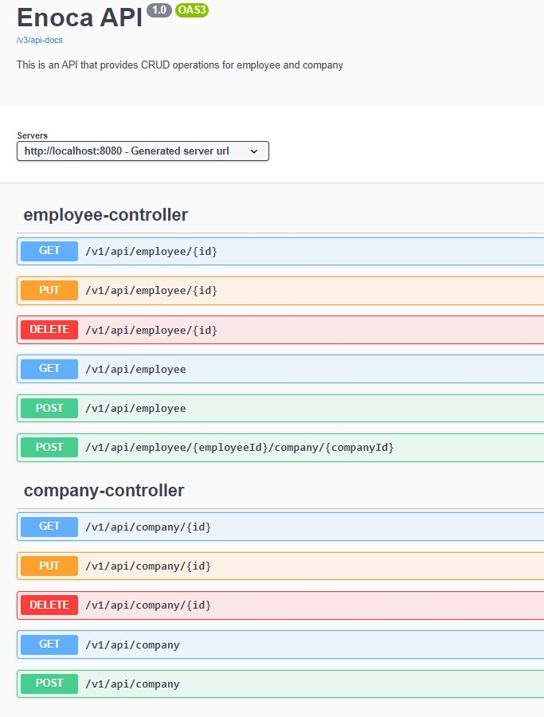

# Enoca Backend Challenge

EnocaAPI, şirket ve çalışan bilgilerini yönetmek için kullanılan bir API'dir.


### Gereksinimler

- Java JDK 17
- Maven
- PostgreSQL veritabanı

### Kurulum

1. Bu repository'i kendi GitHub hesabınıza fork edin veya doğrudan zip olarak indirin.

2. Proje kök dizinine gidin ve aşağıdaki komutu kullanarak projeyi yerel ortamınıza klonlayın:
```bash
   git clone https://github.com/semihBiygit/enoca-challenge.git
```
3. Proje klasörüne gidin:
```bash
   cd enoca-challenge
```
4. Proje kök dizininde yer alan `application.yml` dosyasını güncelleyin. 

5. Uygulamayı derlemek için Maven kullanarak aşağıdaki komutu çalıştırın:
```bash
   mvn clean install
```
6. Uygulamayı başlatmak için aşağıdaki komutu kullanabilirsiniz:
```bash
   mvn spring-boot:run
```
7. API, http://localhost:8080 adresinde çalışmaya başlayacaktır. İsterseniz http://localhost:8080/swagger-ui/index.html adresinden Swagger ile veya Postman gibi bir API test aracı kullanarak API endpointlerine istekler yapabilirsiniz.


# Proje API Dokümantasyonu

Proje, aşağıdaki API endpointlerini sağlar:

## Company API

### Şirket Oluşturma
```
POST /v1/api/company
```
Bu endpoint ile yeni bir şirket oluşturulabilir. İstek gövdesinde `CreateCompanyRequestDto` formatında şirket bilgileri bulunmalıdır.

### Tüm Şirketleri Listeleme
```
GET /v1/api/company`
```
Bu endpoint ile sistemde kayıtlı olan tüm şirketlerin listesi alınabilir.

### Şirket Detayları
```
GET /v1/api/company/{id}
```
Bu endpoint ile belirtilen `id` parametresine sahip bir şirketin detayları alınabilir.

### Şirket Güncelleme
```
PUT /v1/api/company/{id}
```
Bu endpoint ile belirtilen `id` parametresine sahip bir şirketin bilgileri güncellenebilir. İstek gövdesinde `CreateCompanyRequestDto` formatında güncellenecek şirket bilgileri bulunmalıdır.

### Şirket Silme
```
DELETE /v1/api/company/{id} 
```
Bu endpoint ile belirtilen `id` parametresine sahip bir şirket sistemden silinebilir.

## Employee API

### Çalışan Oluşturma
```
POST /v1/api/employee
```
Bu endpoint ile yeni bir çalışan oluşturulabilir. İstek gövdesinde `CreateEmployeeRequestDto` formatında çalışan bilgileri bulunmalıdır.

### Tüm Çalışanları Listeleme
```
GET /v1/api/employee
```
Bu endpoint ile sistemde kayıtlı olan tüm çalışanların listesi alınabilir.

### Çalışan Detayları
```
GET /v1/api/employee/{id}
```
Bu endpoint ile belirtilen `id` parametresine sahip bir çalışanın detayları alınabilir.

### Çalışan Güncelleme
```
PUT /v1/api/employee/{id}
```
Bu endpoint ile belirtilen `id` parametresine sahip bir çalışanın bilgileri güncellenebilir. İstek gövdesinde `CreateEmployeeRequestDto` formatında güncellenecek çalışan bilgileri bulunmalıdır.

### Çalışan Silme
```
DELETE /v1/api/employee/{id}
```
Bu endpoint ile belirtilen `id` parametresine sahip bir çalışan sistemden silinebilir.

### Çalışana Şirket Ekleme
```
POST /v1/api/employee/{employeeId}/company/{companyId}
```
Bu endpoint ile belirtilen `employeeId` ve `companyId` parametrelerine sahip bir çalışana bir şirket eklenabilir.
